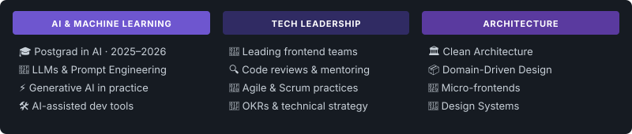

## 👋 About Me

<big>Hi! I'm Anderson, a **Senior Frontend Developer** with over 6 years of experience building high quality web and mobile interfaces and applications. I have been working as a **Tech Lead for over 3 years**, guiding engineering teams through architecture decisions, code quality standards, and development best practices.</big>

<big>🎓 I'm currently deepening my knowledge in **Artificial Intelligence**, pursuing a postgraduate degree focused on AI and its practical applications in modern software development.</big>

<big>💡 I'm passionate about well crafted user experiences, clean code, and an engineering culture that values **DDD**, **TDD**, and solid design patterns. I thrive in collaborative environments where knowledge sharing is part of everyday life.</big>

<big>🚀 My core stack revolves around the **React** ecosystem with strong expertise in **TypeScript**, **Next.js**, and **React Native** but my curiosity constantly drives me to explore new technologies, especially in the AI space and language model-assisted development tools.</big>

## 🛠️ Tech Stack

  

## 📊 GitHub Stats

  

  

## 🎯 Currently Focused On

  

## 📫 Contact

<big>Want to talk about **React**, **TypeScript**, **frontend architecture**, or **Artificial Intelligence**?
I'm always open to exchanging ideas and collaborating on projects that make a difference. 🚀</big>

 

